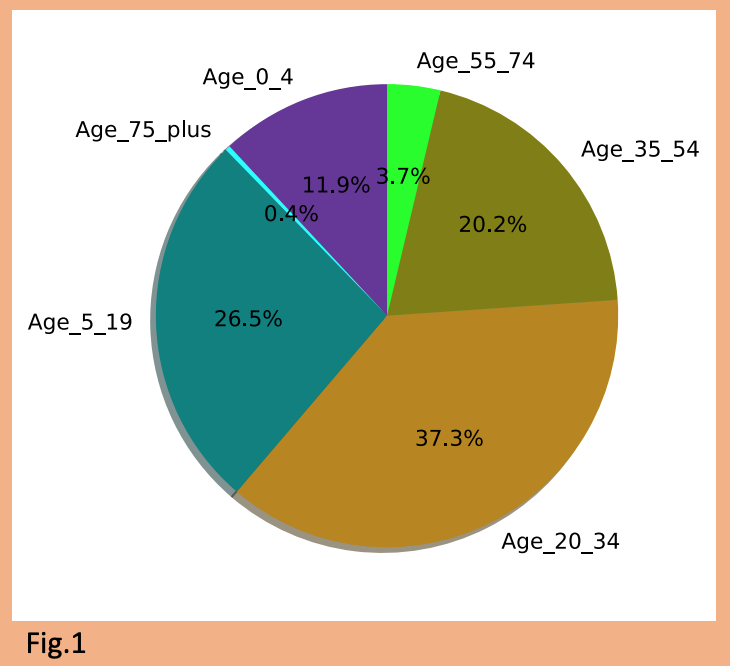
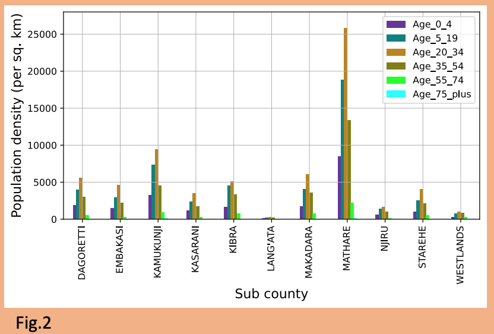
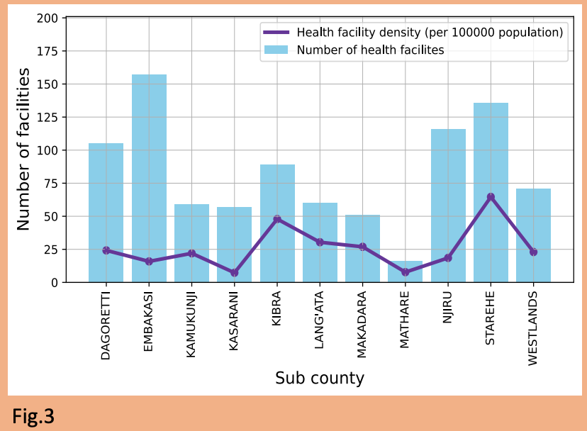
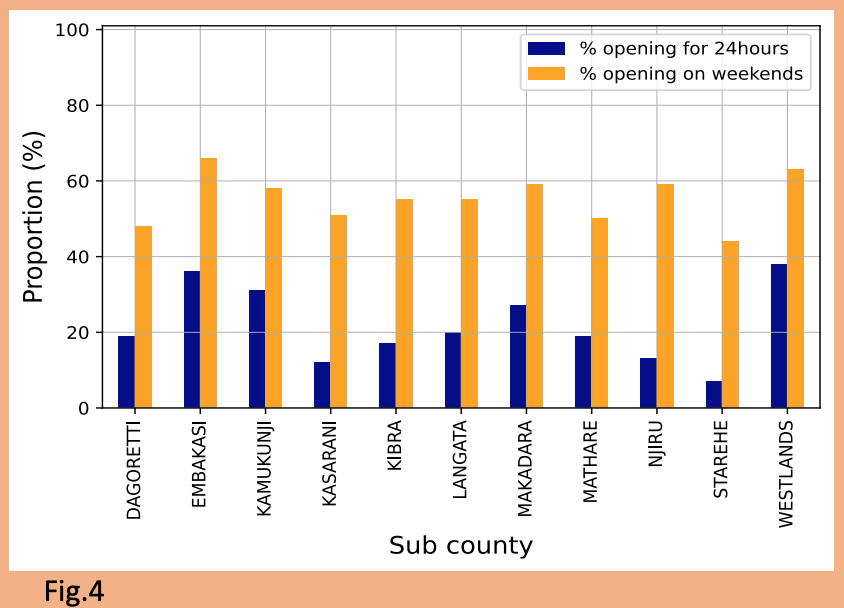
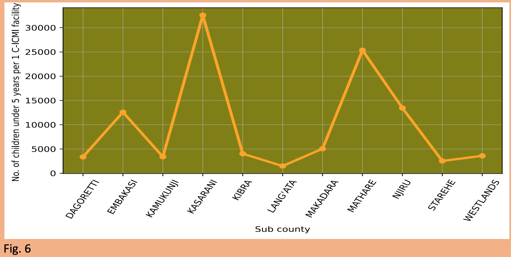

# Enhancing Healthcare Accessibility in Nairobi, Kenya

> A data-driven narrative exploring Nairobi’s healthcare infrastructure in the context of United Nations Sustainable Development Goal 3: Good Health and Wellbeing.

## Introduction

In 2015, the United Nations launched the Sustainable Development Goals (SDGs), a universal call to action to end poverty, protect the planet, and ensure all people enjoy peace and prosperity by 2030. Among these, **SDG 3: Good Health and Wellbeing** stands out as a pivotal target that underpins the success of many other goals. Good health is not only a vital component of human well-being but also a driver of economic progress, educational attainment, and political stability. 

Kenya’s national development plan, **Vision 2030**, integrates health as a pillar for social development, aiming to provide an efficient and high-quality health system. Nairobi, the capital city and economic hub, has a unique responsibility and opportunity to lead the nation in achieving this target. Yet despite promising frameworks and legislative progress—such as the recent establishment of the **Social Health Authority (SHA)**—there remain critical disparities in healthcare accessibility, quality, and availability.

This report leverages population statistics, health facility data, and service availability across sub-counties in Nairobi to present a comprehensive analysis. The findings not only highlight key achievements and gaps but also offer actionable recommendations aligned with the targets of SDG 3.

---

## Nairobi's Demographic Landscape

The first step in enhancing healthcare is understanding the people it serves. According to the **2019 Kenya National Population Census**, Nairobi has a population of **4.397 million**, nearly evenly split between **49% male** and **51% female**.



Figure 1 reveals a striking youth bulge: more than **70%** of Nairobi’s residents are below the age of 35, and **12%** are children under the age of five. This demographic profile poses unique challenges and opportunities. Young people have distinctive health needs—ranging from sexual and reproductive health to mental health services and substance abuse prevention. Children require robust maternal and pediatric care systems to combat preventable diseases.

Healthcare interventions, therefore, must prioritize youth and child-centric services to be effective. These services include expanded immunization, antenatal care, mental health counseling, and school-based health education.



Beyond age, population density varies significantly by sub-county. High-density areas such as **Mathare**, **Kamukunji**, **Makadara**, and **Kibra** are home to thousands living in informal settlements. These zones are more susceptible to public health risks due to poor sanitation, overcrowding, limited mobility, and inadequate access to healthcare services. The density of a population can strain existing healthcare infrastructure, necessitating decentralized and community-level interventions.

---

## Distribution of Healthcare Facilities

While Nairobi hosts a considerable number of health facilities, their distribution does not mirror the population need.



Sub-counties like **Embakasi** and **Starehe** have the highest number of health facilities. However, high numbers can be misleading. **Embakasi**, despite having many clinics and hospitals, has a vast population, resulting in **low healthcare facility density**. On the other hand, **Mathare** and **Kasarani** suffer from both low numbers and low density, exacerbating the healthcare gap.

Accessibility must consider not just the presence of a health facility, but how easily individuals can access it geographically and financially. For many residents of informal settlements, walking long distances or affording transportation to a health center is impractical, if not impossible.

---

## Facility Operational Hours and Service Availability

Availability is also defined by operational hours. Are health services available when people need them? Unfortunately, many are not.



Though **more than 50%** of facilities are open during weekends, less than **30% operate 24 hours**. This is particularly concerning for sub-counties like **Starehe**, where the Nairobi Central Business District (CBD) is located, and where many residents work non-traditional hours.

Inadequate 24/7 services result in delayed treatments, increased emergency room congestion, and worse health outcomes—especially for mothers in labor, accident victims, and patients requiring urgent diagnosis or stabilization. Extending facility hours is not merely a matter of convenience; it is a matter of life and death.

---

## Comprehensive Service Coverage

Availability of essential services is the backbone of any healthcare system. We examined whether Nairobi’s health centers offer vital services such as:

- **ART (Antiretroviral Therapy)**
- **ANC (Antenatal Care)**
- **PMTCT (Prevention of Mother-to-Child Transmission)**
- **TB Diagnostics**
- **EPI (Expanded Program on Immunization)**
- **Basic and Comprehensive Emergency Obstetric Care**


While ART and Family Planning services are moderately distributed, many critical services are almost absent. There are sub-counties with no **ANC**, **PMTCT**, or **obstetric emergency services**. The lack of **TB diagnostics**, **X-ray** facilities, and immunization infrastructure puts the city at risk of disease outbreaks and worsens chronic health disparities.

These service gaps directly compromise Kenya’s ability to meet:
- **SDG 3.1**: Reduce maternal mortality
- **SDG 3.2**: End preventable child deaths
- **SDG 3.3**: Combat HIV/AIDS, TB, and other diseases
- **SDG 3.4**: Reduce premature deaths from NCDs

---

## Pediatric Care: C-IMCI Accessibility



**C-IMCI (Community Integrated Management of Childhood Illnesses)** is a proven strategy to reduce child mortality through better diagnosis and management of pneumonia, diarrhea, malaria, and malnutrition. Sub-counties like **Lang'ata** have relatively better access to C-IMCI services, while **Mathare** and **Kasarani** fall behind.

This disparity is alarming. Given that children under 5 form 12% of Nairobi's population, healthcare systems must prioritize child survival strategies. Expanding C-IMCI coverage can significantly lower child mortality, fulfilling the promises of SDG 3.2.

---

## Conclusions and Strategic Recommendations

The analysis shows that while some sub-counties, such as **Westlands**, **Starehe**, and **Lang'ata**, are making strides in healthcare infrastructure and service provision, others—notably **Mathare**, **Embakasi**, and **Kasarani**—remain severely underserved.

### Key Recommendations

1. **Design Youth-Oriented Health Programs**  
   Expand services for mental health, reproductive education, and preventive screenings.

2. **Prioritize Informal Settlements**  
   Allocate more resources and mobile clinics to densely populated slums.

3. **Establish 24-Hour Health Centers**  
   Extend operational hours for strategic facilities in high-traffic or emergency-prone areas.

4. **Ensure Service Completeness**  
   Equip facilities with maternal care, diagnostics, emergency obstetrics, and immunizations.

5. **Enhance Pediatric Coverage**  
   Focus on C-IMCI programs where child mortality is highest.

6. **Public-Private Partnerships (PPP)**  
   Leverage private sector capacity to fill gaps, especially in diagnostics and emergency care.

---

## Project Structure

```bash
Healthcare-Accessibility-in-Nairobi/
├── data/                # Datasets (Health facilities, Population census)
├── figures/             # Figures used in analysis (fig1.png to fig6.png)
├── notebooks/           # Jupyter notebooks for full data analysis
├── README.md            # Detailed project overview and documentation
└── requirements.txt     # Required Python libraries
