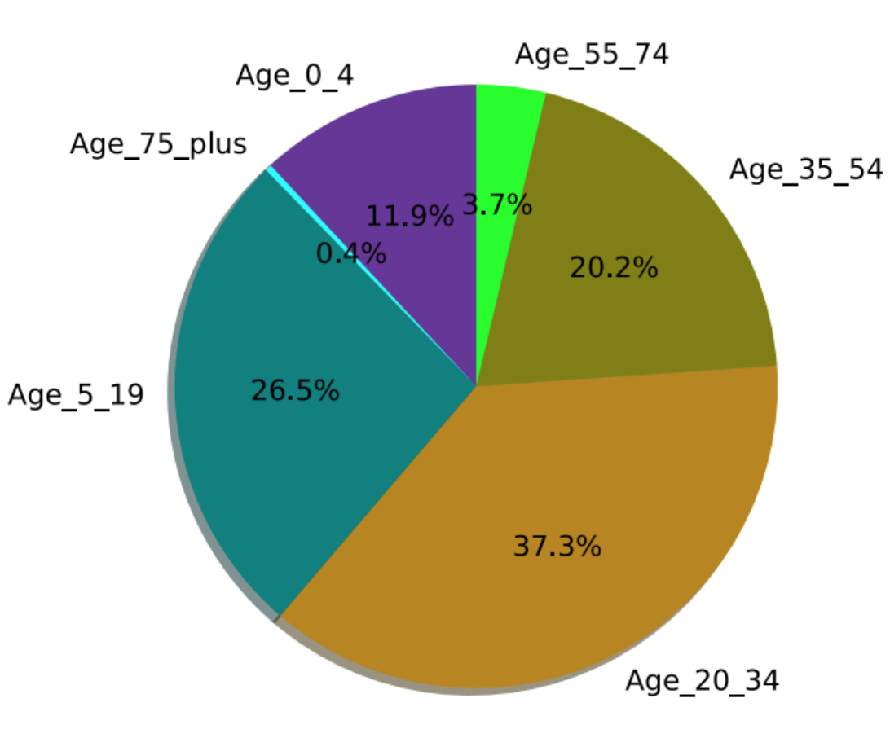
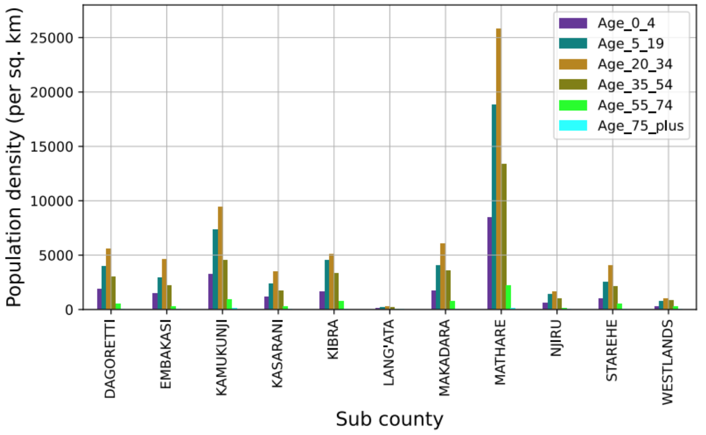
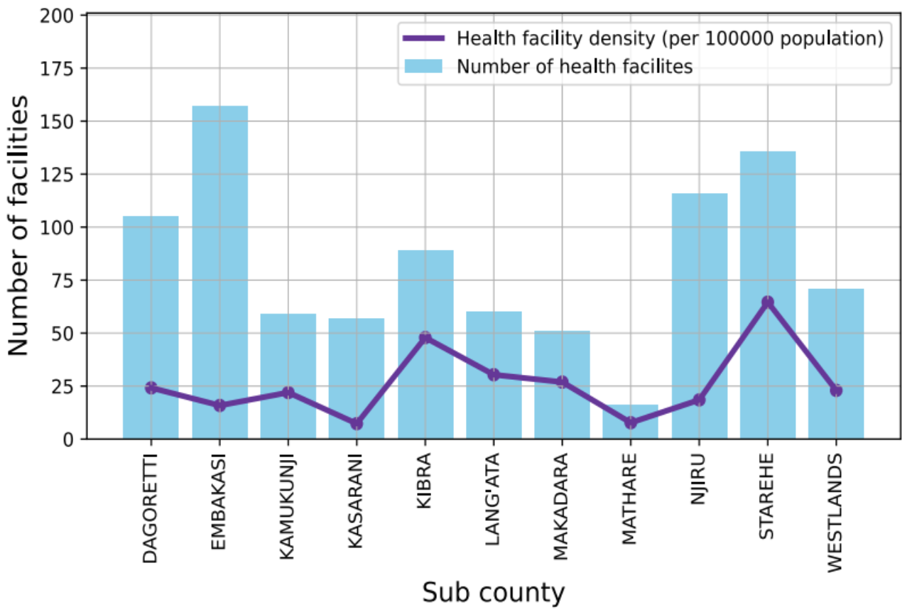
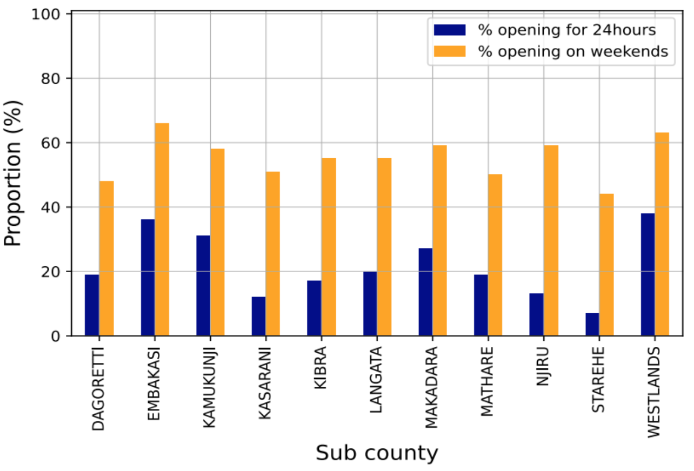
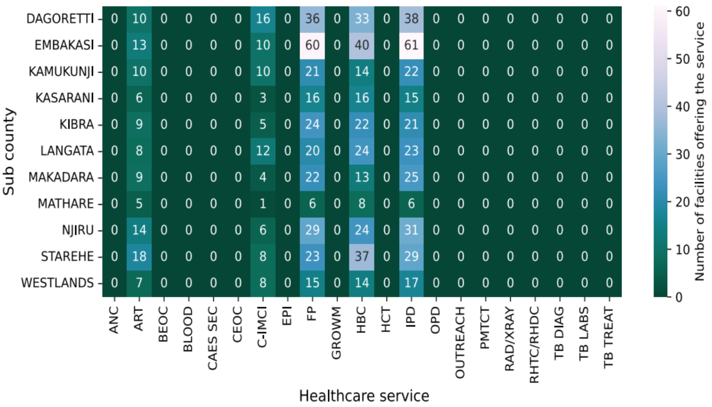
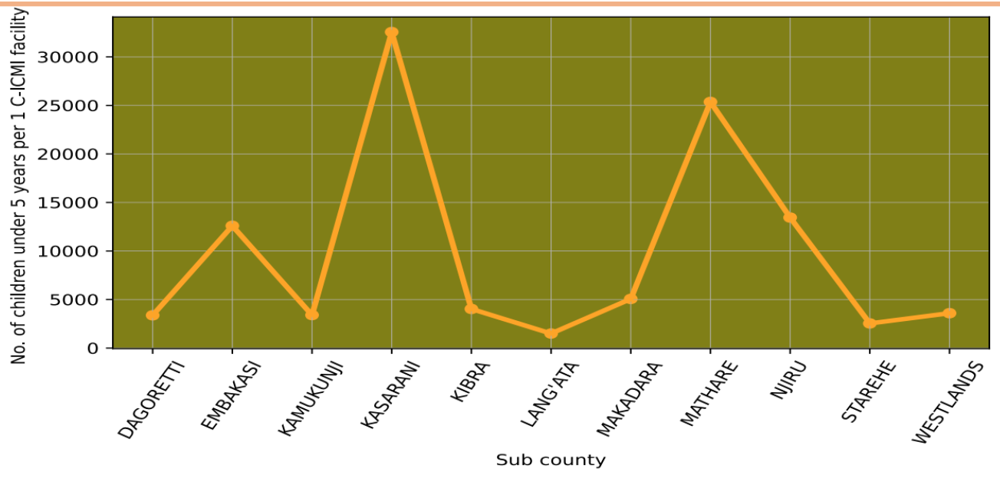

# Enhancing Healthcare Accessibility in Nairobi, Kenya

> A data-driven narrative exploring Nairobi’s healthcare infrastructure in the context of United Nations Sustainable Development Goal 3: Good Health and Wellbeing.

## Introduction

In 2015, the global community adopted the United Nations Sustainable Development Goals (SDGs), a universal blueprint aimed at achieving a better and more sustainable future for all. Among the 17 goals, **SDG 3 – Good Health and Wellbeing** – stands out as a cornerstone for prosperity and equity. Health is not only a fundamental human right but also a prerequisite for economic growth, education, and social development. In Kenya, this vision is embedded in the **Vision 2030** agenda, which strives to provide equitable, affordable, and quality healthcare for all. Nairobi, as the capital city, plays a critical role in realizing this goal.

Despite numerous government initiatives and reforms — including the creation of the Social Health Authority (SHA) — healthcare accessibility in Nairobi remains uneven. This case study uses demographic data, healthcare facility records, and geospatial analysis to evaluate how healthcare is distributed, who is most affected by gaps in service, and what interventions are necessary to meet the targets outlined in SDG 3.

## Demographic Landscape of Nairobi

Understanding population dynamics is essential in designing inclusive health systems. Nairobi’s 2019 census reveals a total population of approximately **4.397 million**. The gender ratio is nearly equal, with **49% male and 51% female**. However, what stands out most is the **age distribution**. Over **70% of Nairobians are under the age of 35**, while **12% are children under 5**.



This age structure presents both an opportunity and a challenge. On the one hand, the city is youthful, vibrant, and full of potential. On the other, it places enormous pressure on reproductive, maternal, and child health services. As such, any strategy to improve healthcare access must be sensitive to this demographic reality. Preventive services, pediatric care, reproductive health, and mental wellness programs should be front and center in policy planning.

Nairobi’s population is not only youthful but also densely concentrated in certain sub-counties. Sub-counties like **Mathare**, **Kamukunji**, **Makadara**, and **Kibra** are densely populated, many containing informal settlements.



These areas often experience systemic disadvantages: poor sanitation, limited infrastructure, high unemployment, and overburdened clinics. Consequently, they are hotspots for both communicable diseases (like TB and HIV) and rising rates of non-communicable diseases (NCDs) such as hypertension and diabetes. Achieving SDG 3.4 (reduce premature mortality from NCDs) and 3.8 (universal health coverage) will require concentrated investment in these underserved zones.

## Distribution and Density of Healthcare Facilities

Healthcare infrastructure varies widely across Nairobi. A surface-level analysis might suggest that facilities are fairly distributed — with sub-counties like **Embakasi** and **Starehe** hosting a relatively large number of clinics and hospitals.



However, a deeper look reveals that this doesn’t necessarily translate into accessibility. For example, **Embakasi** has many health facilities but also a disproportionately large population, resulting in **low facility density** per capita. In contrast, **Mathare** and **Kasarani** suffer from both low numbers and low density, indicating serious healthcare service gaps.

What emerges is a picture of inequality in resource allocation. Overcrowded facilities in high-density areas are likely overburdened, under-resourced, and unable to meet demand. Addressing this imbalance requires building more facilities, particularly in underserved regions, and ensuring that they are fully equipped and staffed.

## Facility Operating Hours and Accessibility

A critical yet overlooked factor in healthcare accessibility is **operational hours**. A clinic that operates only on weekdays or during limited hours cannot serve populations with unpredictable or inflexible schedules — such as shift workers, single parents, or informal laborers.



Our analysis shows that while **over 50%** of facilities operate during weekends — a promising statistic — only **fewer than 30%** offer **24-hour services**. This is a major issue in a city like Nairobi, especially in areas like **Starehe**, which encompasses the CBD and supports a 24-hour economy. Without around-the-clock care, emergency services become bottlenecked, and critical treatment can be delayed.

To align with **SDG 3.8**, healthcare services must not only be physically accessible but also temporally available. This calls for policy reform, funding for night-shift staffing, and public-private partnerships to expand 24-hour coverage.

## Availability of Critical Health Services

The presence of a facility alone doesn’t guarantee comprehensive care. It’s equally important to assess **what services** are offered. Our study examined the availability of essential services such as **ART (antiretroviral therapy)**, **PMTCT (prevention of mother-to-child transmission)**, **ANC (antenatal care)**, and diagnostics like **TB screening** and **X-rays**.



The data shows that while services like ART and Family Planning are relatively widespread, other **critical services are glaringly absent** in most sub-counties. The lack of **ANC**, **PMTCT**, **BEOC/CEOC**, and **EPI** programs severely undermines maternal and child health — endangering progress toward SDG 3.1 (reduce maternal mortality), 3.2 (end preventable deaths of children under 5), and 3.3 (combat epidemics like HIV and TB).

Efforts must focus on equipping facilities with a **comprehensive service package**, especially those in high-density, low-income areas.

## Pediatric Care and C-IMCI Accessibility

Among the most crucial public health programs is **C-IMCI (Community-Integrated Management of Childhood Illness)** — an approach that saves lives by integrating treatment for pneumonia, diarrhea, malaria, and malnutrition, all major child killers in Kenya.



The analysis shows that while sub-counties like **Lang’ata** offer relatively good access to C-IMCI services, **Mathare** and **Kasarani** remain poorly covered. Considering that children under 5 comprise **12% of the population**, these disparities are unacceptable.

Improving C-IMCI access is critical to achieving **SDG 3.2**. It demands not only infrastructure investment but also training of health workers, community outreach programs, and consistent medical supplies.

## Conclusion

This study paints a nuanced picture of Nairobi’s healthcare system — one of partial progress and persistent inequality. Sub-counties like **Starehe**, **Lang’ata**, and **Westlands** exhibit better infrastructure and services, while **Mathare**, **Embakasi**, and **Kasarani** lag dangerously behind. The city’s youth-heavy population, combined with a lack of 24-hour service and critical diagnostics, means that Nairobi is not yet on a sustainable path toward **Universal Health Coverage**.

## Recommendations

1. **Youth-Focused Health Programs**  
   Design and scale programs targeting sexual health, mental wellness, and substance abuse for Nairobi’s under-35 population.

2. **Facility Expansion in Slum Areas**  
   Increase the number and density of clinics in high-density, low-income zones like Mathare, Kibra, and Embakasi.

3. **24/7 Health Services**  
   Prioritize 24-hour operations in urban hubs and emergency-prone areas.

4. **Comprehensive Service Packages**  
   Ensure facilities are equipped with ANC, PMTCT, TB diagnostics, X-rays, and immunization services.

5. **C-IMCI Coverage Expansion**  
   Strengthen child healthcare delivery systems in underserved sub-counties.

---

## Project Structure

```bash
Healthcare-Accessibility-in-Nairobi/
│
├── data/                # Datasets (Health facilities, Population census)
├── figures/             # Figures used in analysis (fig1.png to fig6.png)
├── notebooks/           # Jupyter notebooks for full data analysis
├── README.md            # Detailed project overview and documentation
└── requirements.txt     # Required Python libraries
